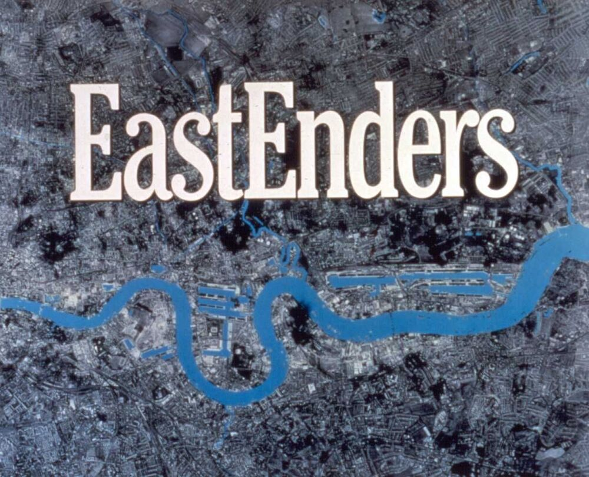
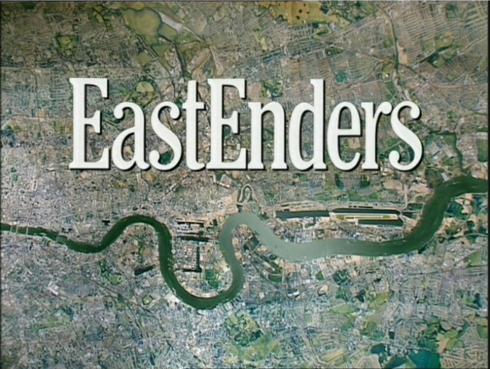
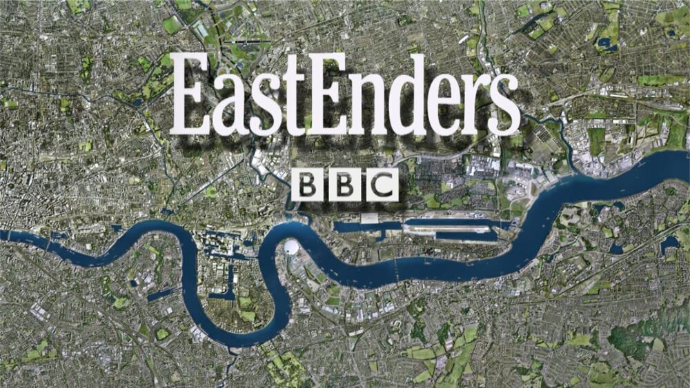

The power of the word EastEnders carries a lot of weight within British television, it has
remained one of the UKs most popular television shows in British history. Throughout its
historic 35-year run the audience have been enticed by their dramatic and powerful
storylines including scandals, murders, romance, betrayal and the surprise arrivals and
departures of iconic characters. It has become a staple throughout so many homes. But,
have you ever wondered about what went into creating such a well-known title screen? And
why it is so recognisable?

Throughout the shows run starting in 1985 to present the background of title screen has
been changed many times due to the ever-changing and evolving landscape of London,
however the typography of the wording of EastEnders has remained the same. This has
created iconic symbol that has allowed viewers to feel comfort in the recognition and
familiarity of the words that greet them and fill their screen. It indicated to many viewers
that it is time to relax and unwind for the day giving them a positive association with the
EastEnders brand.

The EastEnders brand is associated with the three main aspects of the show the theme
tune, the title screen and the ending drum beats tune, but the title screen and more
importantly the typography that has become famous in its own way. It was designed by BBC
designer Alan Jeapes who created the EastEnders identity with a custom font just for the
show in 1985, as well the show uses the typeface called Cheltenham which was originally
created in 1896. This font is unique and well recognised through the enormity of the show,
as it subtly tells you what to expect from the show and some of the key themes
incorporated within.

We can see this as it seems to be a form of classic serif font maybe suggesting EastEnders is
a classic soap opera but with its own unique twists. As well we can also see that it shows a
high X height allowing the words to become more legible and easier to read form a further
distance and at a smaller font size, this seen throughout the showbiz community to better
promote and add awareness to productions as many know if you can’t read the name of the
show, no one will watch it. This is also demonstrated with the colour of the lettering in the
word ‘EastEnders’ as the white is a contrast against the city background and is used to grab
the viewers’ attention as a highlighting tool. The colour white is also associated with
positivity, light, humility and beginnings, this entices the audience as they now associate
EastEnders with these positive connotations and are intrigued to watch it and discover
more.

The font also tells us a lot more as the weight of the typeface is regular throughout
demonstrating that the show is consistent and reliable as it has shown to be, being
consistently on the air for 35 years becoming a comfort to many. Along with the weight the
title also shows a regular width and contrast allowing the audience to see the text clearly
and have great a clear image in their mind to associate with the brand.

Overall, I believe the EastEnders brand demonstrates a very classic image indicating to the
viewers their style and reputation which has been built through the years on screen with
strong consistency and comfort, Unchanging in title and relevance.