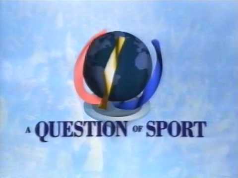

A Question of sport first appeared on our screens in 1970, the television quiz was promised to
have ‘50 years of world sporting action on film, 50 of our greatest sporting stars – in the
studio during the series’ by the Radio times. This has definitely been accomplished as it is
now one the world’s longest running tv sports quizzes filming 1,285 episodes over 50 series,
having over 3,000 different sporting stars appear on the show such as Jessica Ennis Hill,
Denise Lewis, Chris Hoy, Anthony Joshua, Martina Navratilova, Michael Owen and Sebastian
Coe along with many others. As well as a very special appearance from Princess Anne on the
200th episode attracting an audience of over 19 million viewers.

Its long lasting and iconic history has given way to many changes throughout the program
such as font, typeface, colours and technology, however the format of the quiz has
remained largely intact and overall normally starts and ends as originally played.

The opening title card in the 1970s showed the question of sport title screen with a QS in
the centre and ‘A Question OF SPORT’ underneath. The QS is designed in a connective
figuration with the font using a heavy weight throughout with a low contrast this allows it to
be more legible and pronounced through a tv screen capturing the viewers’ attention and
drawing them in. As well with multi coloured strips following along in a design that I believe
to be representing a track. The multi coloured pattern was very new and enticing at the
time to the viewer as regular colour broadcasting went live on BBC1 and ITV in November
1969 this allowed the designers to experiment more and add their own personal touch to
the question of sport brand. This of course grew throughout time as the technology
advanced so did the quality of television brands along with it.

Advancing through the ages the design of the opening title card changed again around 1992.
In this new title sequence a globe object is presented within the centre of the screen and
the question posed throughout entirety of the show at the bottom reading ‘A Question of
Sport’. This new design demonstrates a whole new take on the title screen as it moves away
from the heavy weight and low contrast font and moves towards a more classical display
with regular contrast and regular weight. This allows the text to be seen more clearly and
gives a more professional reputation to the brand. However, the ‘A’ and ‘of’ are reduced in
size compared to the other body of text making the it less legible and harder to read than
the previous title card. Also not giving the audience a recognisable logo to associate the
brand with.