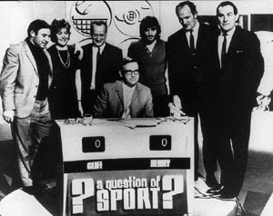
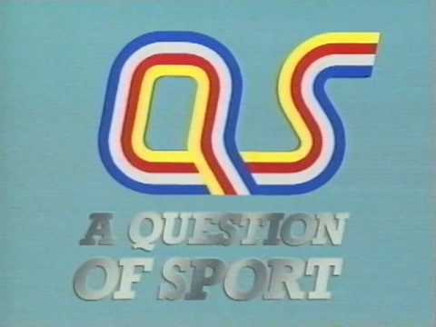

Question of sport first appeared on our screens in 1970, the television quiz was promised to
have ‘50 years of world sporting action on film, 50 of our greatest sporting stars – in the
studio during the series’ by the Radio times. This has definitely been accomplished as it is
now one the world’s longest running tv sports quizzes filming 1,285 episodes over 50 series,
having over 3,000 different sporting stars appear on the show such as Jessica Ennis Hill,
Denise Lewis, Chris Hoy, Anthony Joshua, Martina Navratilova, Michael Owen and Sebastian
Coe along with many others. As well as a very special appearance from Princess Anne on the
200 th episode attracting an audience of over 19 million viewers.

Its long lasting and iconic history has given way to many changes throughout the program
such as font, typeface, colours and technology, however the format of the quiz has
remained largely intact and overall normally starts and ends as originally played.

The opening titles in 1970 showed the question of sport title screen with a QS in the centre
and ‘A Question OF SPORT’ underneath. The QS is designed in multi coloured strips I believe
to be representing a track