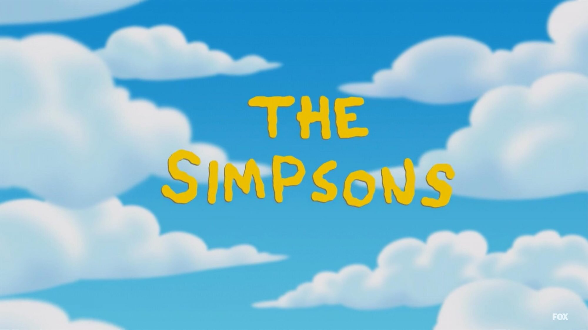
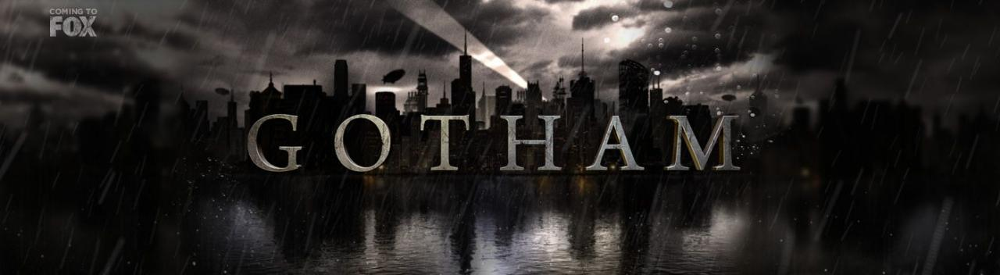

There are many ways in which typography can represent or give an insight to what is beyond the first title screen. We can see it in its colour, structure, texture, and font what is to come. Many are drawn in from this first glimpse of a show and are intrigued to get to know what exactly is behind it. The typography of the first title screen is the first factor in which a person will decide whether or not it is going to be in their own interest to watch.

 

Typography can display a multitude of themes it can display genre, age range and even an insight into the story line. It can hint to the genre of a TV show by using multiple factors. These factors include colour, font and typeface. We can see this demonstrated in many of the TV genres for example if it’s for children there will be bright colours, sans serif font, and a simple typeface. It comes with how we associate these factors with the world around us and our own personal experiences by directing them as one. 

 

Colour links so many of us and can be a symbol for so much more. It can portray the emotions that are prominent within the show such as yellow which can be a representation of warmth, happiness and optimism or red which can represent anger, caution and frustration. It can bring us associations from what we’ve seen and heard in the world around us, green is seen in nature and can be associated with a calm sensation as well as red which can be a representation of danger or blood. This colour coding allows the show to set a tone giving way to different genres of tv such as red connecting to thrillers and horror and green connecting to adventure etc. With these associations you can determine whether a show is that you would want to watch from the associations made to a specific genre. 

 

Another way in which typography can represent the theme of a show is through font, the different styles, weights, contrast and widths can all impact on the viewers association and predictions of a tv show as well as giving insight to what is behind them. If a show title is shown in a serif font and has a heavier weight it is seen more a serious show with maybe some dark themes within whereas if it is shown in a sans serif font and has a lighter weight it is seen in a less serious light and might have a more comedic grasp to it. This can be seen in the two shows The Simpsons and Gotham which are representations of two different themes. 

 

These are some of the ways in which typography can represent a theme of a show.